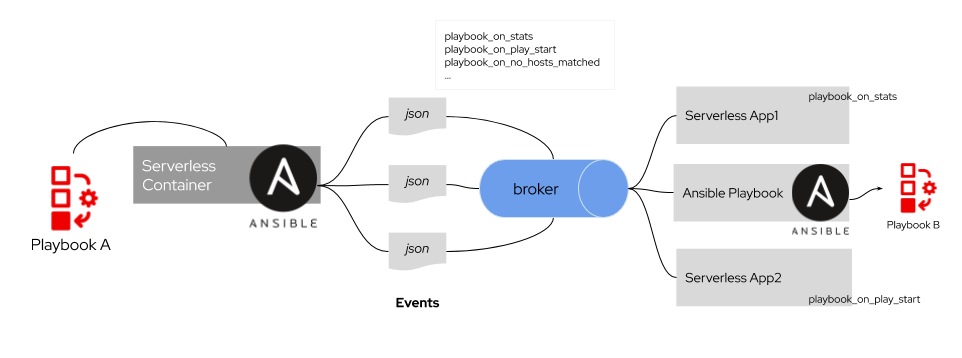

# Ansible Runner as a Knative Service (PoC)

The idea of this PoC is to create a web application that can execute playbooks on demand and send those events to a Knative Event Broker.  Another application will be triggered by those events and can filter by Ansible event types.  

Using events to compose and orchestrate playbooks and applications can be extremely powerful and allow for a more flexible architecture and by leveraging the serverless model, you don't waste resources and have containers spinning up to react to those events only when needed. 



The benefits of this model are: 
- All components of the application can auto-scale up and down (to zero) according to the demand. 
    - If multiple events are sent to a given application, the system can automatically provision more pods to keep up with the demand. 
    - You can define concurrency level for each service.
- You can add/remove steps and orchestrate multiple playbooks asynchronously
- You can trigger applications and other services (notification systems) when a playbook or a step in a playbook is completed. 

## Setup and Requirements

- OpenShift 4.3+ 
- OpenShift Serverless Operator 1.6+
    - Install [`Serving`](https://docs.openshift.com/container-platform/4.3/serverless/installing_serverless/installing-knative-serving.html) and [`Eventing`](https://openshift-knative.github.io/docs/docs/proc_knative-eventing.html) modules. 
    - Download the `kn` CLI for your OS - https://mirror.openshift.com/pub/openshift-v4/clients/serverless/0.13.1/

In order to enable a broker in your namespace you can use an annotation:

`kubectl label namespace default knative-eventing-injection=enabled`

* Replace `default` with your namespace 

If the command succeed you can see the broker by running the following: 

```
kubectl -n markito get broker default 
NAME      READY   REASON   URL                                               AGE
default   True             http://default-broker.markito.svc.cluster.local   17d
```

You can learn more about Knative Brokers [here](https://knative.dev/docs/eventing/broker-trigger/).

## Build and Deploy the Ansible Runner Application

### Build 
If just want to run the sample application, skip this step and go to Deploy. 

Build: 
`docker build . -t quay.io/markito/knative-ansible`

Push: 
`docker push quay.io/markito/knative-ansible`

Replace the image name or repository location with your container registry of choice. DockerHub, Quay, GitHub...

### Create a serverless ansible runner (Deploy)

```
kn service create ansible-runner --image=quay.io/markito/knative-ansible:latest -eBROKER_URL=http://default-broker.markito.svc.cluster.local --limits-cpu=0.5 --limits-memory=100M
Creating service 'ansible-runner' in namespace 'markito':

  0.190s The Route is still working to reflect the latest desired specification.
  0.296s Configuration "ansible-runner" is waiting for a Revision to become ready.
  5.896s ...
  6.067s Ingress has not yet been reconciled.
  6.177s Ready to serve.

Service 'ansible-runner' created to latest revision 'ansible-runner-ppsrg-1' is available at URL:
http://ansible-runner-markito.apps.yourcluster.org
```

* Replace the BROKER_URL value with the URL from the broker of the previous step. 

## Deploy the event consumer and create a trigger

For the sake of the exercise, I'll use a service that simply consume the contents from the broker and prints the content of the messages to sysout. 

`kn service create logger --image rhsummit2020/event-display --autoscale-window 6s`

This application now needs to be wired to the broker in order to receive events.  To do that you need to create a Trigger. 

`kn trigger create logger-trigger --sink svc:logger --broker default`

This will simply consume every single event on the `default` broker and prints the content of the those messages. 

An easy way to tail the logs of multiple containers inside a pod in Kubernetes is to use [`stern`](https://github.com/wercker/stern), which is what I'll use here.  After installing stern run `stern logger` in order to see the logs of all the containers of the logger application. 

## Running a playbook 

You can use `curl` or a browser accessing the url of the application with playbook argument:

```
$ curl "http://ansible-runner-<namespace>.apps.yourcluster.org/?playbook=https://raw.githubusercontent.com/ansible/tower-example/master/helloworld.yml"                                              
Playbook status: successful%
```
* Replace the URL with your cluster URL.

After converting ansible events to Cloud Events, you should see output similar to the example below. 

```
 {"level":"info","ts":"2020-04-22T21:38:24.375Z","logger":"queueproxy","caller":"profiling/server.go:59","msg":"Profiling enabled: true","knative.dev/key":"markito/logger-playbook-stats-nqjsn-1","knative.dev/pod":"logger-playbook-stats-nqjsn-1-deployment-7bc45d96f5-7xszk"}
 ☁️  cloudevents.Event
 Validation: valid
 Context Attributes,
   specversion: 0.3
   type: playbook_on_stats
   source: Red%20Hat
   id: ansible-runner
   time: 2020-04-22T21:38:21.16343698Z
   datacontenttype: application/json
 Extensions,
   knativearrivaltime: 2020-04-22T21:38:21.16338941Z
   knativehistory: default-kne-trigger-kn-channel.markito.svc.cluster.local
   traceparent: 00-96b594af32b6232ad9e7bc87f6b9b9f6-45ab5ba69e9f2e22-00
 Data,
   {
     "uuid": "854e1487-1bf5-4ea6-a99a-001ca16809e1",
     "counter": 7,
     "stdout": "\r\nPLAY RECAP *********************************************************************\r\n",
     "start_line": 6,
     "end_line": 9,
     "runner_ident": "5be0b03b-9329-4d54-97a9-4ae359aab47c",
     "event": "playbook_on_stats",
     "pid": 12,
     "created": "2020-04-22T21:38:20.891226",
     "parent_uuid": "336b2552-1f7e-4e6b-a14d-37d5fad56b8b",
     "event_data": {
       "playbook": "/tmp/playbook.yaml",
       "playbook_uuid": "336b2552-1f7e-4e6b-a14d-37d5fad56b8b",
       "changed": {},
       "dark": {},
       "failures": {},
       "ignored": {},
       "ok": {},
       "processed": {},
       "rescued": {},
       "skipped": {},
       "artifact_data": {},
       "uuid": "854e1487-1bf5-4ea6-a99a-001ca16809e1"
     }
   }
```

The really interesting aspect of this PoC is to leverage the idea of filters and the Ansible Event Types to decide which applications get triggered based on the event type. For example, let's create another application that will only receive events of type `playbook_on_stats`.  First we have to deploy a new serverless application: 

`kn service create logger-playbook-stats --image rhsummit2020/event-display --autoscale-window 6s`

Then we need to create a new trigger but this time with a filter, so that you specificy what type of events this application is interested in receiving. 

`kn trigger create logger-trigger-playbook-stats --filter type=playbook_on_stats --sink svc:logger-playbook-stats --broker default`

## Next Steps and ideas 

- Build an Ansible Event Source. 
- Provide a user experience that allow more complex pipelines/flows to be visualized. 
- Provide a web interface where a user can write and run the playbook without building a container. 